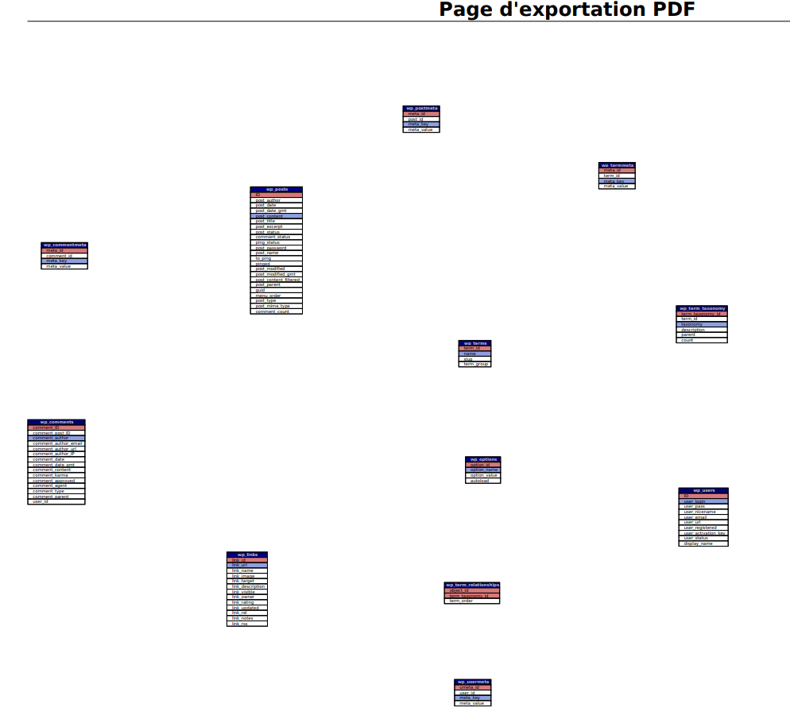

# Rapport - Stage Wordpress

>- [Rapport - Stage Wordpress](#rapport---stage-wordpress)
- [Rapport - Stage Wordpress](#rapport---stage-wordpress)
  - [Première partie : à propos de WordPress](#première-partie--à-propos-de-wordpress)
    - [Qu'est-ce que Wordpress](#quest-ce-que-wordpress)
    - [WordPress est-il beaucoup utilisé ?](#wordpress-est-il-beaucoup-utilisé-)
    - [Combien coûte WordPress ?](#combien-coûte-wordpress-)
    - [Quelle est la différence entre wordpress.com et wordpress.org](#quelle-est-la-différence-entre-wordpresscom-et-wordpressorg)
    - [Qu'est-ce qu'un CMS](#quest-ce-quun-cms)
  - [Deuxième partie : installation locale](#deuxième-partie--installation-locale)
    - [De quoi WordPress a-t-il besoin pour fonctionner ?](#de-quoi-wordpress-a-t-il-besoin-pour-fonctionner-)
    - [Eléments nécessaires pour que Wordpress puisse fonctionner correctement :](#eléments-nécessaires-pour-que-wordpress-puisse-fonctionner-correctement-)
  - [Troisième partie : installation distante](#troisième-partie--installation-distante)
    - [Procédure d’installation de WordPress sur une VM](#procédure-dinstallation-de-wordpress-sur-une-vm)
    - [Etapes nécessaires à l'installation](#etapes-nécessaires-à-linstallation)
      - [1. Installation des dépendances](#1-installation-des-dépendances)
      - [2. Installation de Wordpress](#2-installation-de-wordpress)
      - [3.1 Configuration d'Apache pour Wordpress](#31-configuration-dapache-pour-wordpress)
      - [4. Configuration de la DB](#4-configuration-de-la-db)
      - [5. Configuration de Wordpress à la DB](#5-configuration-de-wordpress-à-la-db)
      - [6. Accéder à l'interface Wordpress](#6-accéder-à-linterface-wordpress)
      - [Problèmes rencontrés avec l'installation de Wordpress à distance :](#problèmes-rencontrés-avec-linstallation-de-wordpress-à-distance-)
    - [3.2 Side Quest : installation de phpmyadmin, accessible par un autre port](#32-side-quest--installation-de-phpmyadmin-accessible-par-un-autre-port)
      - [1. Mettre à jour les paquets installés \& installation de phpMyAdmin](#1-mettre-à-jour-les-paquets-installés--installation-de-phpmyadmin)
      - [2. Ajout du port d'écoute dans `/etc/apache2/ports.conf`](#2-ajout-du-port-découte-dans-etcapache2portsconf)
      - [3. Ajout de la configuration d'Apache pour l'accès à PhpMyAdmin](#3-ajout-de-la-configuration-dapache-pour-laccès-à-phpmyadmin)
      - [4. Redémarrer Apache2 et vérifier si la configuration tourne correctement](#4-redémarrer-apache2-et-vérifier-si-la-configuration-tourne-correctement)
    - [3.3 Tour du propriétaire - Que manque-t-il pour que mon site soit opérationnel ?](#33-tour-du-propriétaire---que-manque-t-il-pour-que-mon-site-soit-opérationnel-)
  - [Quatrième partie : Développement avec Docker (Dev)](#quatrième-partie--développement-avec-docker-dev)
      - [C'est quoi Docker ?](#cest-quoi-docker-)
      - [Quelle est la différence entre Docker et la virtualisation ?](#quelle-est-la-différence-entre-docker-et-la-virtualisation-)
      - [Kit de démarrage de Wordpress avec Docker.](#kit-de-démarrage-de-wordpress-avec-docker)
      - [Quelle est la différence entre Dockerfile, Docker et Docker compose ?](#quelle-est-la-différence-entre-dockerfile-docker-et-docker-compose-)
      - [Différentes notions de Docker](#différentes-notions-de-docker)
      - [Diagramme des tables](#diagramme-des-tables)
  - [Cinquième partie : déploiement avec Docker (Ops)](#cinquième-partie--déploiement-avec-docker-ops)
    - [Kit de démarrage pour déployer Wordpress dans un container Docker sur une VM](#kit-de-démarrage-pour-déployer-wordpress-dans-un-container-docker-sur-une-vm)
      - [Mon déploiement en prod est-il en tout point similaire à celui sur mon ordinateur ?](#mon-déploiement-en-prod-est-il-en-tout-point-similaire-à-celui-sur-mon-ordinateur-)
      - [1. Est-ce que le site peut envoyer des emails, par exemple lorsqu’un mot-de-passe est perdu ?](#1-est-ce-que-le-site-peut-envoyer-des-emails-par-exemple-lorsquun-mot-de-passe-est-perdu-)
      - [2. Est-ce que le site est sécurisé par HTTPS assurant que les informations transitant entre le client et le serveur soient chiffrées ?](#2-est-ce-que-le-site-est-sécurisé-par-https-assurant-que-les-informations-transitant-entre-le-client-et-le-serveur-soient-chiffrées-)
      - [3. Est-ce que les informations importantes du site sont sauvegardées et pourraient être utilisées dans un plan de reprise d’activité (PRA) ?](#3-est-ce-que-les-informations-importantes-du-site-sont-sauvegardées-et-pourraient-être-utilisées-dans-un-plan-de-reprise-dactivité-pra-)
      - [4. Qui pourra accéder à votre site ? Est-il nécessaire de mettre en place un système d’authentification basé sur celui de l’entreprise ?](#4-qui-pourra-accéder-à-votre-site--est-il-nécessaire-de-mettre-en-place-un-système-dauthentification-basé-sur-celui-de-lentreprise-)
      - [Mise en place d'un certificat](#mise-en-place-dun-certificat)
  - [Sixième partie: Wordpress@EPFL](#sixième-partie-wordpressepfl)
  - [Volumétrie](#volumétrie)
    - [Posez-vous la question de combien de sites sont agrégés ensembles](#posez-vous-la-question-de-combien-de-sites-sont-agrégés-ensembles)
    - [Pourquoi pensez-vous que cette façon de faire a été choisie ?](#pourquoi-pensez-vous-que-cette-façon-de-faire-a-été-choisie-)
  - [Dernière partie : wrap up](#dernière-partie--wrap-up)
      - [3 Alternatives ou concurrents à WordPress](#3-alternatives-ou-concurrents-à-wordpress)
      - [Développmeent et modèle commercial Wordpress](#développmeent-et-modèle-commercial-wordpress)
      - [Sites Web utilisés par Wordpress](#sites-web-utilisés-par-wordpress)
  - [Conclusion](#conclusion)
      - [Avantages et inconvénients de WordPress](#avantages-et-inconvénients-de-wordpress)
      - [Est-ce un bon choix de CMS pour l'EFPL ?](#est-ce-un-bon-choix-de-cms-pour-lefpl-)
      - [Bilan du stage](#bilan-du-stage)


## Première partie : à propos de WordPress

### Qu'est-ce que Wordpress

Wordpress est un système de gestion de contenu (CMS) open-source et gratuit pour gérer et créer des sites webs ou blogs.

### WordPress est-il beaucoup utilisé ?

Environ 40% des sites web utilisent Wordpress, ce qui en fait le CMS le plus utilisé.

### Combien coûte WordPress ? 

Wordpress est gratuit d'utilisation. Son hébergement par Wordpress.com est en revanche payante.

### Quelle est la différence entre wordpress.com et wordpress.org

Wordpress.com permet de créer son site et de l'héberger sur un serveur distant (cloud). Wordpress.org représente la version open-source qui sera hébergée par nous-même.

### Qu'est-ce qu'un CMS 

CMS (Content Management System) est une application qui permet de créer, modifier et gérer des sites web ou plateforme, sans avoir de compétences techniques.

## Deuxième partie : installation locale

Installation effectuée avec l'aide de la documentation suivante : https://ubuntu.com/tutorials/install-and-configure-wordpress#1-overview

### De quoi WordPress a-t-il besoin pour fonctionner ?

Wordpress a été installé dans un environnement Windows WSL avec une distribution Ubuntu 22.04 Jammy LTS. Les étapes provenant donc de la documentation ont été suivies:

1. Installation des dépendances apache et php: 

```sh
sudo apt update
sudo apt install apache2 \
                ghostscript \
                libapache2-mod-php \
                mysql-server \
                php \
                php-bcmath \
                php-curl \
                php-imagick \
                php-intl \
                php-json \
                php-mbstring \
                php-mysql \
                php-xml \
                php-zip
```

2. Installation de Wordpress.org : 

```sh 
sudo mkdir -p /srv/www
sudo chown www-data: /srv/www
curl https://wordpress.org/latest.tar.gz | sudo -u www-data tar zx -C /srv/
```

3. Configuration d'Apache pour Wordpress : 

Création d'un site Apache en local port 80 avec la configuration suivante: 

```sh
<VirtualHost *:80>
    DocumentRoot /srv/www/wordpress
    <Directory /srv/www/wordpress>
        Options FollowSymLinks
        AllowOverride Limit Options FileInfo
        DirectoryIndex index.php
        Require all granted
    </Directory>
    <Directory /srv/www/wordpress/wp-content>
        Options FollowSymLinks
        Require all granted
    </Directory>
</VirtualHost>
```

4. Autorisation d'accès au site/url et désactivation par défaut pour éviter les conflits: 

```sh 
sudo a2ensite wordpress
sudo a2enmod rewrite
sudo a2dissite 000-default
```

5. Création de la DB MySQL et du user : 

```sql
sudo mysql -u root

CREATE DATABASE <nom_db>;

CREATE USER wordpress@localhost IDENTIFIED BY '<your-password>';

GRANT SELECT,INSERT,UPDATE,DELETE,CREATE,DROP,ALTER
    -> ON wordpress.*
    -> TO wordpress@localhost;

FLUSH PRIVILEGES;

quit
```

6. Configurer Wordpress et les accès à la DB : 

remplacer les champs dans le fichier /srv/www/wordpress/wp-config.php par le user crée :

```sh
sudo -u www-data cp /srv/www/wordpress/wp-config-sample.php /srv/www/wordpress/wp-config.php

sudo -u www-data sed -i 's/database_name_here/wordpress/' /srv/www/wordpress/wp-config.php
sudo -u www-data sed -i 's/username_here/wordpress/' /srv/www/wordpress/wp-config.php
sudo -u www-data sed -i 's/password_here/<your-password>/' /srv/www/wordpress/wp-config.php
```

Vérifier si tous les champs ont bel et bien été affectés :

```sh
sudo -u www-data nano /srv/www/wordpress/wp-config.php
```

changer les champs d'authentification suivants avec des accès générés aléatoirement à ce lien https://api.wordpress.org/secret-key/1.1/salt/ : 

```sh
define( 'AUTH_KEY',         'put your unique phrase here' );
define( 'SECURE_AUTH_KEY',  'put your unique phrase here' );
define( 'LOGGED_IN_KEY',    'put your unique phrase here' );
define( 'NONCE_KEY',        'put your unique phrase here' );
define( 'AUTH_SALT',        'put your unique phrase here' );
define( 'SECURE_AUTH_SALT', 'put your unique phrase here' );
define( 'LOGGED_IN_SALT',   'put your unique phrase here' );
define( 'NONCE_SALT',       'put your unique phrase here' );
```

7. accéder au Wordpress en local :

Wordpress devrait être accessible au lien suivant : http://localhost.
Ensuite, configuer Wordpress.

### Eléments nécessaires pour que Wordpress puisse fonctionner correctement : 
- Machine avec WSL installé et une distribution Ubuntu plus récente que 20.04 LTS
- les prérequis `php` et `apache2`
- une DB MySQL configurée et accessible 

## Troisième partie : installation distante 

###  Procédure d’installation de WordPress sur une VM 

Comme à l'étape précédente, l'installation de Wordpress sur la VM a été effectuée avec l'aide de la documentation suivante : https://ubuntu.com/tutorials/install-and-configure-wordpress#1-overview

### Etapes nécessaires à l'installation

#### 1. Installation des dépendances 

```sh
sudo apt update
sudo apt install apache2 \
                 ghostscript \
                 libapache2-mod-php \
                 mysql-server \
                 php \
                 php-bcmath \
                 php-curl \
                 php-imagick \
                 php-intl \
                 php-json \
                 php-mbstring \
                 php-mysql \
                 php-xml \
                 php-zip
```

#### 2. Installation de Wordpress 

```sh
sudo mkdir -p /srv/www
sudo chown www-data: /srv/www
curl https://wordpress.org/latest.tar.gz | sudo -u www-data tar zx -C /srv/www
```

#### 3.1 Configuration d'Apache pour Wordpress

```sh
<VirtualHost *:80>
    DocumentRoot /srv/www/wordpress
    <Directory /srv/www/wordpress>
        Options FollowSymLinks
        AllowOverride Limit Options FileInfo
        DirectoryIndex index.php
        Require all granted
    </Directory>
    <Directory /srv/www/wordpress/wp-content>
        Options FollowSymLinks
        Require all granted
    </Directory>
</VirtualHost>
```

Activation du site : `sudo a2ensite wordpress`
Activation de le ré-ecriture de l'URL : `sudo a2enmod rewrite`
Désactivation du site par défaut : `sudo a2dissite 000-default`

#### 4. Configuration de la DB

Il existe 2 configurations possibles pour créer un utilisateur MySQL : par interface graphique ou alors par CLI. Dans notre cas, nous allons y procéder par CLI:

1. Accès à la DB avec l'utilisateur root : `sudo mysql -u root`
2. Créer une nouvelle DB : `CREATE DATABASE <nom_db>;`
3. Création d'un utilisateur : `CREATE USER <user_name>@localhost IDENTIFIED BY '<your-password>';`
4. Donner des droits : `GRANT SELECT,INSERT,UPDATE,DELETE,CREATE,DROP,ALTER` `ON wordpress.*` `TO wordpress@localhost;` `FLUSH PRIVILEGES;` et `quit`

#### 5. Configuration de Wordpress à la DB

Ajouter les champs suivants avec la modification du mot de passe crée au point précédent :

```sh
sudo -u www-data sed -i 's/database_name_here/wordpress/' /srv/www/wordpress/wp-config.php
sudo -u www-data sed -i 's/username_here/wordpress/' /srv/www/wordpress/wp-config.php
sudo -u www-data sed -i 's/password_here/<your-password>/' /srv/www/wordpress/wp-config.php
```

#### 6. Accéder à l'interface Wordpress

Accéder à l'interface par l'IP depuis un navigateur : `http://<ip_de_la_vm>`. Puis se connecter avec le compt crée

#### Problèmes rencontrés avec l'installation de Wordpress à distance : 
- configuration d'Apache2, notamment avec le fait que l'application soit écoutée sur le port 80 -> solution : changer la configuration des ports d'écoute : 
`sudo nano /etc/apache2/ports.conf`
- accessibilité à l'ip via un navigateur (dans mon cas Google Chrome/Brave) 

### 3.2 Side Quest : installation de phpmyadmin, accessible par un autre port 

#### 1. Mettre à jour les paquets installés & installation de phpMyAdmin

```sh 
sudo apt upgrade && sudo apt install phpmyadmin
```

#### 2. Ajout du port d'écoute dans `/etc/apache2/ports.conf`

```sh 
Listen 8080
```

PhpMyAdmin sera accessible par le port 8080.

#### 3. Ajout de la configuration d'Apache pour l'accès à PhpMyAdmin 

```sh
<VirtualHost *:8080>
    DocumentRoot /srv/share/phpmyadmin
    <Directory /srv/share/phpmyadmin>
        Options FollowSymLinks
        AllowOverride Limit Options FileInfo
        DirectoryIndex index.php
        Require all granted
    </Directory>
    <Directory /srv/share/phpmyadmin>
        Options FollowSymLinks
        Require all granted
    </Directory>
</VirtualHost>
ubuntu@wp-thomas:/etc/a
```

#### 4. Redémarrer Apache2 et vérifier si la configuration tourne correctement

```sh 
sudo systemctl restart apache2
sudo ss -tulnp | grep :8080
```

L'URL est maintenant accessible via le lien suivant : http://<ip_vm>:8080/phpmyadmin. 

### 3.3 Tour du propriétaire - Que manque-t-il pour que mon site soit opérationnel ? 

Pour que le site Wordpress soit opérationnel, il faut :
- choisir un thème dans apparence 
- créer des pages (pages d'accueil et secondaires)
- Permalinks (URLs propres)
- installation de plugins comme SEO


## Quatrième partie : Développement avec Docker (Dev)

#### C'est quoi Docker ?
Docker est un ervice permettant de créer, déployer et gérer des conteneurs. 

#### Quelle est la différence entre Docker et la virtualisation ?
Les conteneurs crées par Docker partagent le même noyau et ressources que la machine hôte, ce qui le rend bien plus léger et permet aux application de tourner de manière autonome. La virtualisation émule un ordinateur complet avec son OS et des ressources virtuelles propres à elle. Elles (VM) sont généralement plus lourdes et consomment plus de ressources.

#### Kit de démarrage de Wordpress avec Docker. 

1. Installer docker : 

```sh
sudo apt-get update 
sudo apt-get install docker
```

2. Créer un fichier docker-compose.yaml avec le contenu suivant :

```yaml
version: "3.9"

services: 
  db: 
    image: mysql:8.0
    container_name: wordpress_db
    restart: always
    environment: 
      MYSQL_ROOT_PASSWORD: root
      MYSQL_DATABASE: wordpress
      MYSQL_USER: wordpress
      MYSQL_PASSWORD: epfl
    volumes: 
      - db_data:/var/lib/mysql

  wordpress:
    image: wordpress:latest
    container_name: wordpress_app
    depends_on:
      - db
    ports: 
      - "8080:80"
    restart: always
    environment: 
      WORDPRESS_DB_HOST: db:3306
      WORDPRESS_DB_USER: wordpress
      WORDPRESS_DB_PASSWORD: epfl
      WORDPRESS_DB_NAME: wordpress
    volumes: 
      - wordpress_data:/srv/www/wordpress

volumes: 
  db_data:
  wordpress_data:
```

3. Lancer le container : 

Premièrement, vérifier que docker soit bien en route et ensuite générer le container
```sh
docker compose up -d
```

4. Accéder à l'adresse http://localhost et vérifier que tout fonctionne

#### Quelle est la différence entre Dockerfile, Docker et Docker compose ?
- Dockerfile : Fichier texte contenant des instructions sur la génération d'une image Docker. S'exécute avec `Docker build`.
- Docker compose : Permet d'orchestrer les conteneurs issues des images Dockerfile. Il définit les services, les ports exposés et volumes montés. S'exécute avec la commande `docker compose up -d`
- Docker : Moteur qui exécute les conteneurs et responsable de la gestion/suppression des conteneurs. S'exécute avec `docker run`, `docker stop`, `docker ps`, ...

#### Différentes notions de Docker
- Ports : canaux de communication entre le conteneur et l'extérieur (mappage de 8080 vers 80 : `8080:80`)
- Volumes : répertoies qui sont partagés entre machine hôte et conteneur. 
- Environnements : permettent de configurer les applications qui tournent à l'intérieur du conteneur
- entrer dans un Docker : accéder à l'intérieur d'un container pour exécuter des commandes et inspecter son contenu

#### Diagramme des tables


## Cinquième partie : déploiement avec Docker (Ops)

### Kit de démarrage pour déployer Wordpress dans un container Docker sur une VM

1. Clôner le repository git une fois accédé à la VM : 
```sh 
git clone https://github.com/Thomas-vn/fiche-de-stage-WordPress/tree/main?tab=readme-ov-file#
```

2. Mettre en place l'environnement d'exécution de Wordpress et de Docker. 
Un fichier Makefile a été prévu à cet effet, il suffit juste d'exécuter les commandes suivantes au répertoire courant du projet.

  a. Installer Docker sur la machine
  ```sh
  make install-docker
  ``` 

  b. Mise en place de l'image Wordpress et phpmyadmin dans 3 containers: 
  ```sh
  make start-wordpress
  ```

  c. (optionnel) Autres commandes utiles:
  Arrêter les containers :
  ```sh
  make stop-wordpress
  ```

  Supprimer les containers : 
  ```sh
  make clean
  ```

#### Mon déploiement en prod est-il en tout point similaire à celui sur mon ordinateur ?

Non, car ma machine personnellea comme OS Windows 11 avec un Sub-system Linux (WSL). Elle nécessite Docker Desktop pour lancer les images Docker et la syntaxe utilisée est relativement différente. De plus, la gestion des volumes entre les containers et la machine hôte se fait sur le File System Windows. 

La VM sur laquelle Wordpress a été déployée est une machine Linux: 

```sh
$ lsb_release -a
No LSB modules are available.
Distributor ID: Ubuntu
Description:    Ubuntu 24.04.3 LTS
Release:        24.04
Codename:       noble
```

#### 1. Est-ce que le site peut envoyer des emails, par exemple lorsqu’un mot-de-passe est perdu ?

Il existe des plugins tel que WP Mail SMTP, Mailgun ou Sengrid pour envoyer des mails par le site. Néanmoins, une configuration des paramètres est nécessaire dans le tableau de bord Wordpress. 

#### 2. Est-ce que le site est sécurisé par HTTPS assurant que les informations transitant entre le client et le serveur soient chiffrées ?

Non, le site utilise uniquement le port HTTP pour le transit d'informations. Il est nécessaire de mettre en place un certificat SSL/TLS pour activer HTTPS.

#### 3. Est-ce que les informations importantes du site sont sauvegardées et pourraient être utilisées dans un plan de reprise d’activité (PRA) ?

Non, la configuration Wordpress effectuée ne comprend pas de sauvegarde automatique des données du site. Il existe des plugins pour effectuer des "Backups" pour sauvegarder les données du site.

#### 4. Qui pourra accéder à votre site ? Est-il nécessaire de mettre en place un système d’authentification basé sur celui de l’entreprise ?

Wordpress utilise un système d'authentification intégré qui permet de créer des utilisateurs et des rôles. 

#### Mise en place d'un certificat 
1. Générer une clé privée sur le site (OpenSSL)
2. Générer une demande de certificat avec la clé privée (CSR)
3. SOumettre la demande du certificat une authorité de certification (CA) et obtenir un certificat TLS/SSL
4. Installer le certificat sur le serveur web 
5. Configurer le certificat

## Sixième partie: Wordpress@EPFL

## Volumétrie 

### Posez-vous la question de combien de sites sont agrégés ensembles
Il existe environ 900 sites qui sont abrégés ensemble au sein du domaine epfl.ch

###  Pourquoi pensez-vous que cette façon de faire a été choisie ?
- Pour des raisons d'évolutivité et maintenances
- Gouvernance des données facilitée
- Personnalisation de certaines fonctionnalités et contenu 

## Dernière partie : wrap up

#### 3 Alternatives ou concurrents à WordPress 
- a. Joomla 
- b. Drupal 
- c. Hostinger

#### Développmeent et modèle commercial Wordpress

Le développement est géré par WordPress Foundation pour promouvoir le développement de l'application. Ils peuvent ganger de l'argent en offrant de l'hébergement des sites, la personnalisation des services/thèmes/plugins et la formation de l'outil.

#### Sites Web utilisés par Wordpress
- Site de la BBC 
- Site de la NASA
- Site de l'EPFL

## Conclusion 

#### Avantages et inconvénients de WordPress

`+` : Facilité d'utilisation 
`+` : Thèmes personnalisables
`+` : possibilité d'ajouter et de créer ses propres plugins

`-` : Performance peu optimale

#### Est-ce un bon choix de CMS pour l'EFPL ?

WordPress est un choix judicieux pour l'EPFL en raison de sa facilité d'utilisation et de sa flexibilité. En effet, il est facile d'ajouter de nouveaux sites ou de modifier les configurations existantes. De plus, WordPress est un outil résilient et adaptable, capable de répondre aux besoins évolutifs de l'institution.

#### Bilan du stage

Tout au long de ce stage, j'ai appris à :

- Installer et configurer WordPress sur une machine locale
- Déployer WordPress sur une VM avec Docker
- Configurer phpMyAdmin pour accéder à la base de données
- Mettre en place un certificat SSL pour sécuriser le site
- Créer un kit de démarrage pour déployer WordPress dans un container Docker sur une VM
- Développer un site Web avec WordPress et personnaliser son contenu

Ce que j'ai aimé :
- La configuration de WordPress et la personnalisation de son contenu
- Le déploiement de WordPress sur une VM avec Docker, qui m'a permis de comprendre les 
principes de la conteneurisation

Ce que j'ai moins aimé :
- L'apprentissage de l'outil WordPress, qui a nécessité une certaine période d'adaptation
- Le débuggage de déploiement, qui a été parfois fastidieux et a nécessité une certaine patience